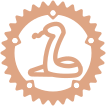

  

# Hebi

This repository hosts a dynamically typed language, its compiler, and VM.

### Why Hebi?

I thought it was appropritate, because the language is in the Python family, and Hebi (蛇) means snake in Japanese. 

### License

Licensed under either of

- Apache License, Version 2.0
  ([LICENSE-APACHE](LICENSE-APACHE) or http://www.apache.org/licenses/LICENSE-2.0)
- MIT license
  ([LICENSE-MIT](LICENSE-MIT) or http://opensource.org/licenses/MIT)

at your option.

### Contribution

Unless you explicitly state otherwise, any contribution intentionally submitted
for inclusion in the work by you, as defined in the Apache-2.0 license, shall be
dual licensed as above, without any additional terms or conditions.

[^1]: Using `samples` instead of `examples` is intentional, and is done because of [this issue](https://github.com/bkchr/proc-macro-crate/issues/14) in the `proc-macro-crate` crate, which is used to resolve the crate name in Hebi's proc macros. It also helps with compile times, as dependencies such as `clap` and `rustyline` don't have to exist in the top-level `Cargo.toml` under `dev-dependencies`.
